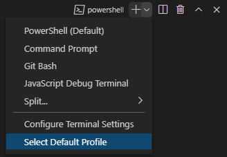

# SE-Assignment-5
Installation and Navigation of Visual Studio Code (VS Code)
 Instructions:
Answer the following questions based on your understanding of the installation and navigation of Visual Studio Code (VS Code). Provide detailed explanations and examples where appropriate.

 Questions:

1. Installation of VS Code:
   - Describe the steps to download and install Visual Studio Code on Windows 11 operating system. Include any prerequisites that might be needed.

  Download VS Code:
Visit the official VS Code download page.
Choose the version specific to your OS (Windows).
The download process will start automatically.

Installation:
Once the download is complete, open the downloaded file (usually named VSCodeUserSetup-{version}.exe).
Accept the license terms and conditions.
Click “Next” and then “Install.”

Launch VS Code:
After installation, click the “Launch” button to start using VS Code.

2. First-time Setup:
   - After installing VS Code, what initial configurations and settings should be adjusted for an optimal coding environment? Mention any important settings or extensions.

Initial Configurations and Settings:

Interface Customization:

Adjust font size, theme, and color scheme (Settings > Appearance)
Customize keyboard shortcuts and menu bar (Settings > Keyboard Shortcuts, Settings > Menu Bar)
Workspace Settings:

Set default language, file associations, and code formatting styles (Settings > Workspace Settings)
Install necessary extensions for specific programming languages or tools
General Settings:

Enable auto-save and auto-indent (Settings > Editors)
Adjust update notifications and telemetry settings (Settings > General)

3. User Interface Overview:
   - Explain the main components of the VS Code user interface. Identify and describe the purpose of the Activity Bar, Side Bar, Editor Group, and Status Bar.

      1. Editor: The primary space for editing your files. You can open multiple editors side by side, both vertically and horizontally. Each editor displays the content of a file you’re working on.

       2. Side Bar: This area contains various views, such as the Explorer, which assists you while working on your project. The Explorer shows all files and folders in your workspace.

       3. Status Bar: Located at the bottom, it provides information about the currently opened project and the files you’re editing. For example, it displays Git status when you’re working with version control.

       4. Activity Bar: Positioned on the far left, it allows you to switch between different views (like Explorer, Source Control, Extensions, and more). It also provides context-specific indicators, such as the number of outgoing changes when Git is enabled.  

       5. Panel: An additional space below the editor region. By default, it contains output, debug information, errors, warnings, and an integrated terminal. You can move the Panel to the left or right for more vertical space.

4. Command Palette:
   - What is the Command Palette in VS Code, and how can it be accessed? Provide examples of common tasks that can be performed using the Command Palette.

       The Command Palette in Visual Studio Code (VS Code) is a powerful tool that allows you to access various features, commands, and settings directly via keyboard shortcuts or a menu. To open it:

Press Ctrl+Shift+P (Windows/Linux) or Cmd+Shift+P (Mac).
Alternatively, use the F1 key.
You can also find it in the Application Menu under View > Command Palette.
Here are some common tasks you can perform using the Command Palette:

Run Commands: Execute specific commands by typing their names. For example, you can format code, switch themes, or install extensions.
Go to Line or File: Quickly navigate to a specific line or file by typing “Go to Line” or “Go to File.”
Change Settings: Modify VS Code settings without digging through menus. Type “Preferences: Open Settings” to access settings directly.
Search Symbols: Find functions, classes, or variables within your project by typing “Go to Symbol.”
Toggle Features: Enable or disable features like word wrap, line numbers, or minimap by searching for their corresponding commands.

5. Extensions in VS Code:
   - Discuss the role of extensions in VS Code. How can users find, install, and manage extensions? Provide examples of essential extensions for web development.
     
     Extensions play a crucial role in enhancing Visual Studio Code (VS Code) by adding features, themes, and tools. Here’s how users can manage extensions:

Finding Extensions:
Click the Extensions icon in the Activity Bar (or use ⇧⌘X / Ctrl+Shift+X).
Search for extensions by name or functionality.
Install desired extensions directly from the Visual Studio Code Marketplace1.
Installing Extensions:
Once you find an extension, click Install.
After installation, the button changes to Manage.
For example;
JavaScript (ES6) Code Snippets: Provides JavaScript, TypeScript, Vue, React, and HTML code snippets, saving you from repetitive coding2.

CSS Peek: Jump directly to CSS code using classes and IDs2.

Auto Close Tag: Automatically adds closing tags for HTML and XML2.

REST Client: Test APIs and view responses within VS Code2.

ESLint: Linting utility for JavaScript, catching common errors in real-time2.

Prettier: Auto-formats your code with customizable rules

6. Integrated Terminal:
   - Describe how to open and use the integrated terminal in VS Code. What are the advantages of using the integrated terminal compared to an external terminal?

     The integrated terminal in VS Code is a powerful feature that allows you to run commands, build, and debug directly within the editor. Here’s how to use it:

Opening the Integrated Terminal:
Press Ctrl+** (Windows/Linux) or **Cmd+ (Mac).
Alternatively, go to View > Terminal from the menu.

Using the Integrated Terminal:

You’ll see a terminal at the bottom of the VS Code window.
Type commands directly into the terminal and press Enter to execute them.

You can navigate to your project directory using cd commands.
Run build scripts, start servers, or manage Git using the terminal.

 **Advantages of the Integrated Terminal**:

Seamless Workflow: No need to switch between VS Code and an external terminal.

Context Awareness: The terminal opens in the project folder, so you’re always in the right context.

Customization: You can choose your preferred shell (e.g., PowerShell, Bash, or Command Prompt).

Split View: You can split the terminal horizontally or vertically alongside your code.

the integrated terminal streamlines your development process and keeps everything in one place!

7. File and Folder Management:
   - Explain how to create, open, and manage files and folders in VS Code. How can users navigate between different files and directories efficiently?

   Creating Files and Folders:
To create a new folder, follow these steps:
Click the “New Folder” button in the Explorer view (shaped like a folder with a plus sign) or right-click in the Explorer and select “New Folder”.
Name your folder.

To create a new file, do the following:

Right-click on the folder where you want to create the file.
Choose “New File” and provide a name with the appropriate extension (e.g., .html, .css, .js).
Opening Folders and Files:
Open a single-folder workspace by simply opening a folder in VS Code. 
To open a workspace (multi-root or single-folder):
Use File > Open Folder… and select the desired folder 
Alternatively, if you launch VS Code from a terminal, pass the folder path as an argument (e.g., code . to open the current folder)

Use keyboard shortcuts (e.g., Ctrl+Tab) to cycle through open files.
Use breadcrumbs at the top of the editor to navigate within a file.
Use the “Go to File” command (Ctrl+P) to search for and open files by name.
Install extensions like “Path Intellisense” for auto-completion of file paths.

8. Settings and Preferences:
   - Where can users find and customize settings in VS Code? Provide examples of how to change the theme, font size, and keybindings.

   Accessing Settings:
Open the Settings editor by navigating to File > Preferences > Settings.
Alternatively, use the Command Palette (⇧⌘P or Windows/Linux Ctrl+Shift+P) and search for Preferences: Open Settings (UI) 
   User Settings vs. Workspace Settings:
User settings apply to all projects, while workspace settings only affect the current project.
You can configure both types of settings.
   Examples of Customization:
  Change Theme:
Open the Settings editor.
Search for “Color Theme” and choose your desired theme (e.g., “Dark+ (default dark)” or “Light+ (default light)”) 
Adjust Font Size:
Search for “Font Size” in the Settings editor.
Modify the “Editor: Font Size” setting to your preferred size (e.g., 14px) 
Modify Keybindings:
Search for “Keybindings” in the Settings editor.
Click “Edit Keybindings” to customize keybindings or add your own shortcuts

9. Debugging in VS Code:
   - Outline the steps to set up and start debugging a simple program in VS Code. What are some key debugging features available in VS Code?
steps;
  1. create a Sample Application:
Before debugging, set up a simple application.
  2. Access the Run and Debug View:
Click the Run and Debug icon in the Activity Bar (or use the shortcut  Ctrl+Shift+D).
This view displays all run and debug information, including commands and settings.

  3. Launch Configurations:
While you can run your active file directly, it’s better to create a launch configuration (stored in launch.json).
To create one:
Click “Create a launch.json file” in the Run start view.
VS Code will try to detect your debug environment.

Debugging Features:
  1. Breakpoints: Set breakpoints in your code to pause execution and inspect variables.
  2. Step Through Code:
   Use keyboard shortcuts (e.g., F10, F11) to step over, into, or out of functions.
   Explore the call stack.
3. Watch Variables: Monitor variable values during debugging.
4. Conditional Breakpoints: Pause execution based on conditions.
5. Hover Inspection: Hover over variables to see their values.
6. Debug Console: Interact with your app using the debug console.
7. Exception Handling: Configure how exceptions are handled.
8. Run and Debug Toolbar: Access common debugging commands 

10. Using Source Control:
    - How can users integrate Git with VS Code for version control? Describe the process of initializing a repository, making commits, and pushing changes to GitHub.

 1. Install Git:
Make sure Git is installed on your machine.
VS Code will use your system’s Git installation.
 2. Open a Project in VS Code:
Open your project folder in VS Code.
The Source Control icon in the Activity Bar on the left will show an overview of changes in your repository.
 3. Initialize a Repository:
Click the Source Control icon.
Select “Initialize Repository” to create a new Git repository in your project folder.
 4. Stage and Commit Changes:
Make changes to your files.
In the Source Control view, you’ll see “CHANGES” with unstaged changes.
Click the “+” icon next to a file to stage it (equivalent to git add).
Type a commit message above the changes and press Ctrl+Enter to commit (equivalent to git commit).
5. Push to GitHub:
If you haven’t already, create a GitHub repository.
In VS Code, click the three dots (…) in the Source Control view.
Select “Push” to push your committed changes to GitHub.

references;
code.visualstudio.com
learn.microsoft.com
microsoft.github.io

 Submission Guidelines:
- Your answers should be well-structured, concise, and to the point.
- Provide screenshots or step-by-step instructions where applicable.
- Cite any references or sources you use in your answers.
- Submit your completed assignment by 1st July 

